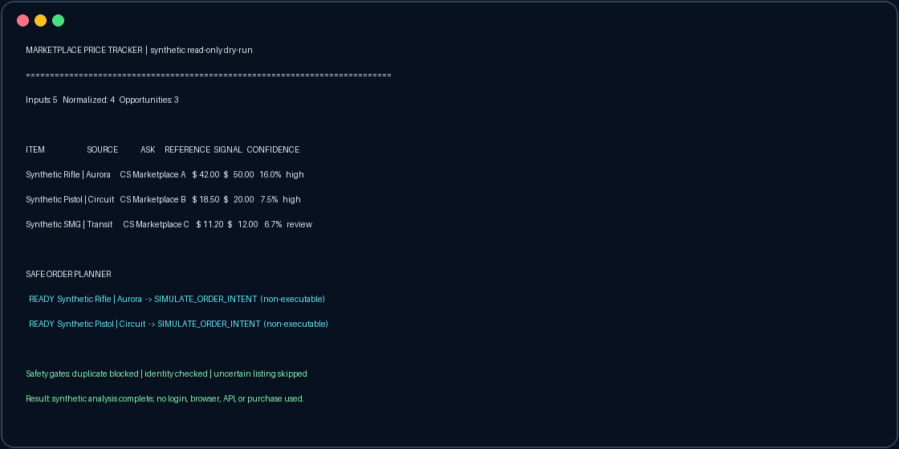

# Marketplace Price Tracker

> A synthetic demonstration of how software can compare listings across CS
> marketplaces, identify pricing gaps, and prepare safe, non-executable order
> intents.


Marketplace data is messy: the same item can appear under different sources,
duplicate records can arrive in one scan, and a cheap listing is not useful if
its identity cannot be verified. This project turns that problem into a small,
auditable pipeline.

It combines the public engineering ideas behind two private automation
projects—continuous market monitoring and bargain buy-order planning—without
including live integrations, private strategy, credentials, or operational
configuration.

## Dry-run tracker

The screenshot is generated from a deterministic synthetic run. Before it is
written, an automatic sanitizer masks account-like text, local user paths,
token-shaped values, and long identifiers.



## What it demonstrates

1. **Ingest** listings from multiple abstract CS marketplace sources.
2. **Normalize** them into one typed internal record.
3. **Deduplicate** equivalent source/item observations deterministically.
4. **Verify identity** before a listing can enter analysis.
5. **Compare** the observed price with a synthetic reference value.
6. **Rank** positive signals while retaining uncertainty for human review.
7. **Plan** at most one non-executable intent per item.

The result is understandable to an operator and inspectable by an engineer:
every row has a source, comparison, confidence level, and clear disposition.

## Engineering highlights

| Concern | Public implementation |
| --- | --- |
| Cross-source data | Immutable typed records and one normalized model |
| Duplicate listings | Stable identity key and deterministic best-record selection |
| Bad or missing values | Fail-closed validation before analysis |
| Uncertain signals | Visible as `review`, never promoted automatically |
| Repeated actions | One intent per normalized item identity |
| Live execution risk | No credentials, adapters, browser control, or order endpoint |
| Reproducibility | Synthetic fixtures, deterministic ordering, unit tests |

## Quick start

```bash
git clone <repository-url>
cd Marketplace-Price-Tracker
python demo.py --dry-run
python -m unittest discover -s tests -v
```

Optional editable installation:

```bash
python -m pip install -e .
price-tracker-demo --dry-run
```

## Pipeline

```text
synthetic sources
       |
       v
normalize -> deduplicate -> verify identity -> compare -> rank
                                                        |
                                                        v
                                         safe order-intent planner
                                         (non-executable output)
```

The public planner deliberately stops before any transaction layer. It shows
how duplicate protection and confidence gates can be designed without
revealing or distributing a working marketplace buyer.

## Repository layout

```text
.
├── assets/                       # Sanitized dry-run screenshot
├── docs/architecture.md          # Pipeline and safety boundaries
├── scripts/                      # Reproducible asset generation
├── src/marketplace_price_tracker/
│   ├── pipeline.py               # Normalization, analysis, and safe planning
│   └── cli.py                    # Synthetic terminal report
├── tests/                        # Identity, duplicate, and fail-closed tests
├── demo.py                       # Zero-setup entry point
└── pyproject.toml
```

## Safety and privacy

All names and values in this repository are synthetic. There are no account
details, browser profiles, private marketplace identifiers, strategy limits,
credentials, notification endpoints, or live transaction code. The screenshot sanitizer is
kept in the repository so the privacy step is reviewable and repeatable.

## Scope

This is a portfolio-grade architectural demonstration, not a trading product.
The private systems that inspired it include independent data collectors,
long-running monitors, and additional verification. Their marketplace-specific
logic and operational parameters are intentionally excluded.

See [the architecture notes](docs/architecture.md) for the public design.
