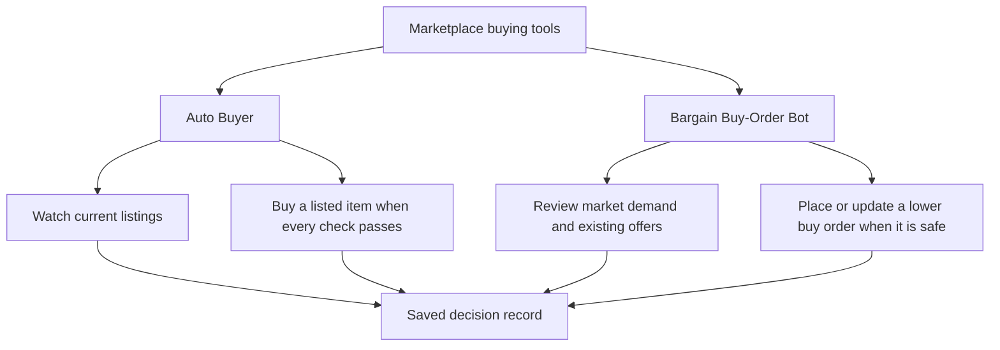
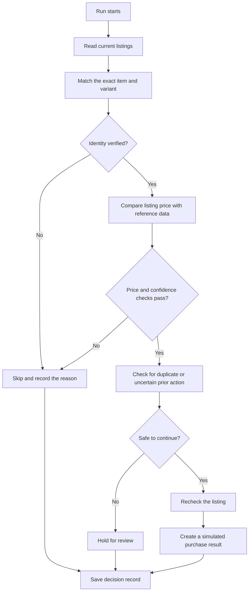
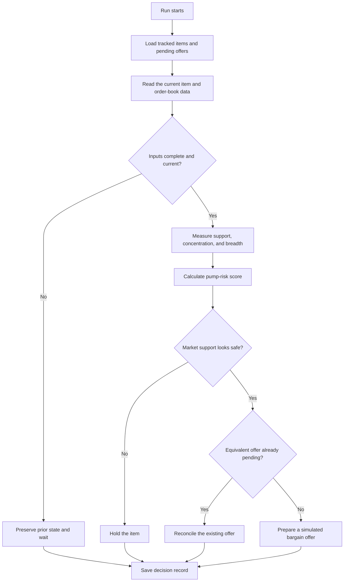

# Marketplace Price Tracker

This repo shows two marketplace bots I built for buying items on CS
marketplaces:

1. **Auto Buyer:** watches live listings and buys an item only when its price,
   identity, and safety checks all pass.
2. **Bargain Buy-Order Bot:** looks for items where a lower offer may work,
   checks the strength of the market, and manages buy orders without sending
   the same offer twice.

The public version uses fake items and prices. It shows how the decisions work,
but it has no account login, private settings, or live purchase connection.

## How the two bots fit together



The bots solve different problems. The Auto Buyer reacts to an item that is
already listed for sale. The Bargain Buy-Order Bot tries to get a better price
by making and managing offers.

## 1. Auto Buyer

The Auto Buyer reads current listings, matches each listing to the exact item,
compares the price with a trusted reference, and rejects anything that is
unclear. A qualifying listing still passes duplicate and last-second safety
checks before the bot can treat it as ready.

### Auto Buyer flow



### Main checks

| Check | Purpose |
| --- | --- |
| Item identity | Stops two similar item variants from being compared as if they were the same |
| Price comparison | Measures whether the current listing is actually below its reference value |
| Confidence | Keeps weak or incomplete results in review instead of calling them ready |
| Duplicate protection | Allows only one result for the same item during a pass |
| Final recheck | Makes sure the listing has not changed before the action boundary |
| Public safety boundary | Produces a simulated result and never contacts a purchase endpoint |

The order of these checks matters. A large discount is not useful if the item
match is uncertain. The bot verifies the item first and fails safely when it
cannot prove what it is looking at.

## 2. Bargain Buy-Order Bot

The Bargain Buy-Order Bot looks for items where a seller may accept an offer
below the listed price. Before it prepares an offer, it checks existing and
pending orders, visible demand, the spread of that demand, and signs that the
market may be temporarily pumped.

### Bargain Buy-Order Bot flow



### Pump check

One large order level can make demand look stronger than it really is. The
public demo measures three parts of the visible order book:

- `support_share`: how much visible demand is close to the reference area;
- `concentration`: how much demand comes from the single largest level;
- `breadth`: how widely demand is spread across the visible levels.

It combines them into a simple example score:

```text
pump_score =
    0.50 x concentration
  + 0.35 x (1 - support_share)
  + 0.15 x (1 - breadth)
```

This formula is only here to show the design. The repo does not include real
targets, private thresholds, item IDs, or production pricing rules.

### Offer safety

- Existing and pending offers are checked before another offer is considered.
- An unknown offer result stays uncertain instead of being sent again.
- A seller counter-offer is kept separate from a new item opportunity.
- Weak or concentrated demand causes a hold.
- A safe result still stops at a simulated offer in this public repo.

## Shared rules

| Rule | Result |
| --- | --- |
| Invalid values are rejected | Missing or non-positive prices cannot move forward |
| Identity must be verified | Price never overrides an unclear item match |
| One item gets one action | Duplicate candidates cannot create repeated purchase or offer results |
| Unknown outcomes stay unknown | The bots do not guess that an action failed and retry it |
| Pump-like demand is blocked | Concentrated demand is held for review |
| Public output cannot execute | Every purchase and offer result is simulated |

## Run the demo

```bash
git clone <repository-url>
cd Marketplace-Price-Tracker
python demo.py --dry-run
```

The command prints results for both bots using fake listings and order-book
data. It does not open a browser or connect to a marketplace.

## Run the tests

```bash
python -m unittest discover -s tests -v
```

The tests cover item matching, duplicate blocking, invalid data, lower
confidence results, pump-risk calculation, missing order-book data, and the
non-executable output boundary. GitHub Actions runs the same tests and demo on
every push and pull request.

## Repository layout

```text
.
├── docs/architecture.md
├── src/marketplace_price_tracker/
│   ├── pipeline.py       # Auto Buyer listing checks and ranking
│   ├── market_shape.py   # Buy-order support and pump checks
│   ├── bidder.py         # Bargain Buy-Order Bot decisions
│   └── cli.py            # Combined fake-data report
├── tests/
├── demo.py
└── pyproject.toml
```

## Public version

All item names, sources, prices, order-book levels, and decisions are fake.
This repo contains no credentials, browser profiles, private marketplace IDs,
strategy limits, notification links, or live transaction code.

See [the architecture notes](docs/architecture.md) for the module map.
