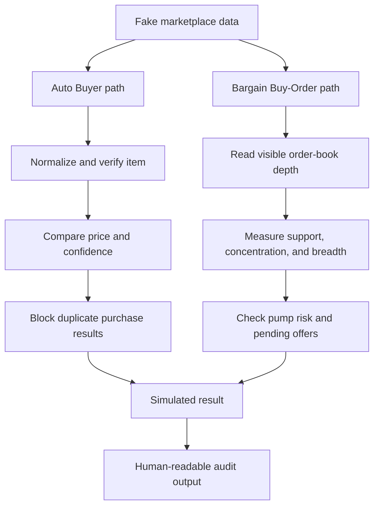

# Architecture

This public demo keeps input data, checks, and final decisions separate. That
makes both bots easier to test without a browser or marketplace account.

## Files

### `pipeline.py`

Defines the listing and opportunity records used by the Auto Buyer demo. It
normalizes items, removes duplicate observations, verifies identity, compares
prices, assigns confidence, and keeps one result per item.

### `market_shape.py`

Turns order-book levels into support share, concentration, breadth, and an
example pump-risk score. Empty or invalid depth returns the safest result.

### `bidder.py`

Combines a verified item with the market-shape result for the Bargain
Buy-Order Bot. High pump risk causes a hold. Lower confidence causes review. A
consistent result creates a simulated offer.

### `cli.py`

Runs both demos with fixed fake data and prints one report.

## Safety limits

- No source adapter connects to a real marketplace.
- An unclear item match stops the decision.
- Missing order-book depth stops the offer.
- Duplicate items cannot create repeated results.
- Unknown outcomes are never retried as confirmed failures.
- Every result has `executable=false`.
- Real thresholds, IDs, credentials, and request formats are not included.
